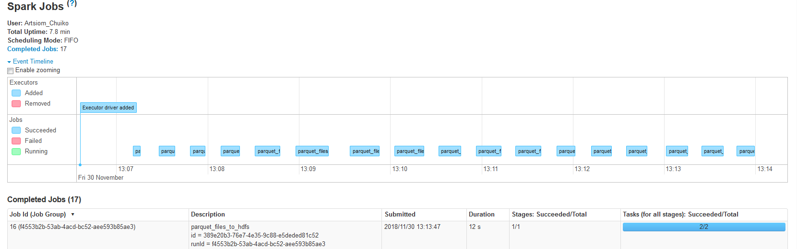
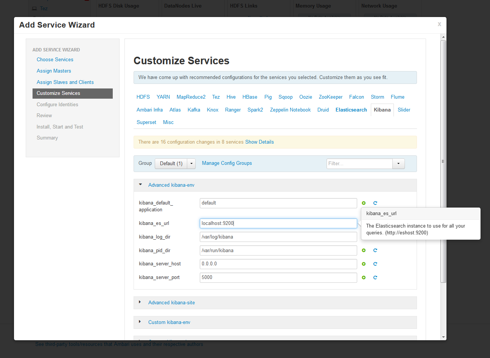
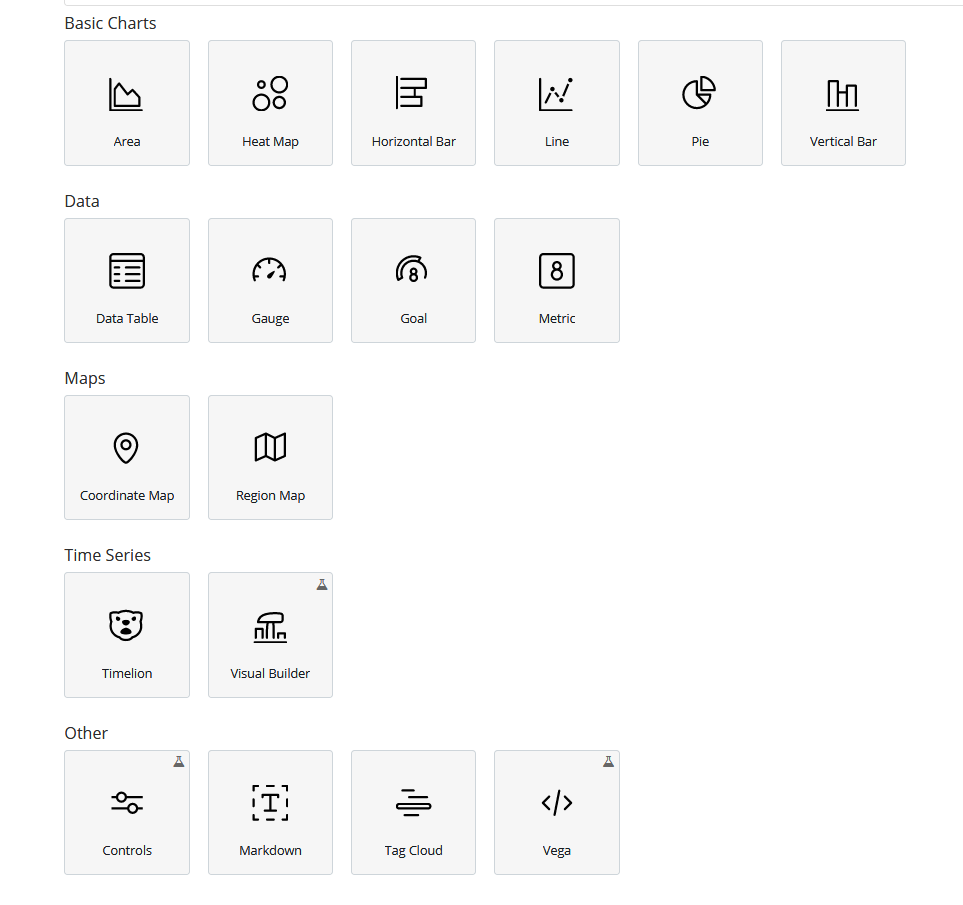

## Task 1 (Spark Streaming)

### How to build artifacts

Run ```sbt "project <name>" assembly```, where `<name>` is the name of the module (batching, streaming, elastic).

### How to generate events and write them to Kafka

Create kafka topic (with the name AvroTopic) using:

```
kafka-topics.sh --create --zookeeper localhost:2181 --replication-factor 1 --partitions 3 --topic AvroTopic
```

To generate 10000 events and put them into Kafka:

```
java -jar \
    -Dakka.kafka.producer.kafka-clients.bootstrap.servers=localhost:9092 \
    -Dakka.kafka.producer.topic.name=AvroTopic \
    -Dakka.kafka.producer.parallelism=10 \
    -Dgenerator.number-of-events=10000 \
    -Dscala.time \
    generator.jar
```

- `akka.kafka.producer.parallelism` - tuning parameter of how many sends that can run in parallel
- `akka.kafka.producer.kafka-clients.bootstrap.servers` - broker list
- `akka.kafka.producer.topic.name` - topic name


### Batching vs Streaming

#### What is Batch Processing?

Batch processing is where the processing happens of blocks of data that have already been stored over a period of time.
In our case, processing all the events that have been emitted by a device in a day.
This data contains 5_000_000 of records for a day that can be stored as a record in a Kafka topic.
This particular topic will undergo processing at the end of the day for various analysis that we want to do.
Obviously it will take large amount of time for that amaount of data to be processed. That would be what Batch Processing is.

Batch processing works well in situations where you don’t need real-time analytics results, and when it is more important to process large volumes of data to get more detailed insights than it is to get fast analytics results.

#### What is Stream Processing?

Stream processing is a golden key if you want analytics results in real time.
Stream processing allows us to process data in real time as they arrive and quickly detect conditions within
small time period from the point of receiving the data. Stream processing allows us to feed data into analytics
tools as soon as they get generated and get instant analytics results.

#### Batch and Stream comparison

In Batch Processing it processes over all or most of the data
but In Stream Processing it processes over data on rolling window or most recent record.
So Batch processing handles a large batch of data while Stream processing handles
individual records or micro batches of few records.
In the point of performance the latency of batch processing will be in a minutes to hours
while the latency of stream processing will be in seconds or milliseconds.

Batch processing is generally appropriate for use cases where having the most up-to-date data is not important and where tolerance for slower response time is higher. For example, offline analysis of historical data to compute results or identify correlations is a common batch processing use case.

Stream processing, on the other hand, is necessary for use cases that require live interaction and real-time responsiveness. Financial transaction processing, real-time fraud detection, and real-time pricing are examples that best fit stream processing.

#### Spark API

In this app I'm using Structured Streaming API so I can write streaming queries the same way that I write batch queries. They are pretty much similar.


In both snippets, data is read from Kafka and written to file. The differences are:

|Batch|Streaming|
|:-----------|:-----------|
read|readStream
write|writeStream
save|start

The streaming operation also uses awaitAnyTermination(), which waits until any of the queries on the associated SQLContext has terminated since the creation of the context, or since `resetTerminated()` was called (if any query was terminated with an exception, then the exception will be thrown).

#### Spark Batch and Stream Jobs execution

Let's generate 5000000 events and put them to Kafka:

```shell
...
INFO: Processed events=24296 Throughput=24320.32 ev/s
Nov 30, 2018 12:48:01 PM akka.actor.ActorSystemImpl
INFO: Processed events=23336 Throughput=23336.00 ev/s
Nov 30, 2018 12:48:02 PM akka.actor.ActorSystemImpl
INFO: Processed events=23136 Throughput=23159.16 ev/s
Nov 30, 2018 12:48:03 PM akka.actor.ActorSystemImpl
INFO: Processed events=23840 Throughput=23840.00 ev/s
Nov 30, 2018 12:48:04 PM akka.actor.ActorSystemImpl
INFO: Processed events=24304 Throughput=24328.33 ev/s
Nov 30, 2018 12:48:05 PM akka.actor.ActorSystemImpl
INFO: Processed events=24984 Throughput=24909.27 ev/s
Nov 30, 2018 12:48:06 PM akka.actor.ActorSystemImpl
INFO: Processed events=24688 Throughput=24492.06 ev/s
Nov 30, 2018 12:48:07 PM akka.actor.ActorSystemImpl
INFO: Processed events=26592 Throughput=26647.94 ev/s
Nov 30, 2018 12:48:08 PM akka.actor.ActorSystemImpl
INFO: Done
[total 228963ms]
```

Now let's check out our topic size (the topic should have 3 partitions and in total 5_000_000 records):

```
>./kafka-run-class.sh kafka.tools.GetOffsetShell --broker-list 192.168.99.100:9092 --topic TestTopic --time -1
TestTopic:2:1666667
TestTopic:1:1666666
TestTopic:0:1666667
```

Then start the batch job:
```
spark-submit \
    --class by.artsiom.bigdata101.hotels.batching.Main \
    --master yarn-client
    batching.jar \
    localhost:9092 AvroTopic hdfs://localhost:9000/tmp/batching-out
```


And here are some execution details for the Batch job:


As you can see, all 5000000 events were successfully processed and saved to HDFS. It took 2.7 minutes and 310Mb of disk space.

Also, I should mention that the batch job can be executed only after sending all the events to Kafka. In case of the Stream job, our generator (events producer) can work at the same time the Stream job working.
Let's see.

Start the job:
```
spark-submit \
    --class by.artsiom.bigdata101.hotels.streaming.Main \
    --master yarn-client
    streaming.jar \
    localhost:9092 AvroTopic hdfs://localhost:9000/tmp/batching-out
```

Also, run the generator:

```shell
java -jar \
    -Dakka.kafka.producer.kafka-clients.bootstrap.servers=localhost:9092 \
    -Dakka.kafka.producer.topic.name=AvroTopic \
    -Dakka.kafka.producer.parallelism=20 \
    -Dgenerator.number-of-events=5000000 \
    -Dscala.time \
    generator.jar
...
INFO: Processed events=7536 Throughput=8000.00 ev/s
Nov 30, 2018 1:13:36 PM akka.actor.ActorSystemImpl
INFO: Processed events=13008 Throughput=12879.21 ev/s
Nov 30, 2018 1:13:37 PM akka.actor.ActorSystemImpl
INFO: Processed events=20952 Throughput=20049.76 ev/s
Nov 30, 2018 1:13:38 PM akka.actor.ActorSystemImpl
INFO: Processed events=21624 Throughput=21908.81 ev/s
Nov 30, 2018 1:13:39 PM akka.actor.ActorSystemImpl
INFO: Processed events=23616 Throughput=24221.54 ev/s
Nov 30, 2018 1:13:40 PM akka.actor.ActorSystemImpl
INFO: Processed events=23456 Throughput=23597.59 ev/s
Nov 30, 2018 1:13:41 PM akka.actor.ActorSystemImpl
INFO: Processed events=15896 Throughput=15816.92 ev/s
Nov 30, 2018 1:13:42 PM akka.actor.ActorSystemImpl
INFO: Processed events=10888 Throughput=10790.88 ev/s
Nov 30, 2018 1:13:43 PM akka.actor.ActorSystemImpl
INFO: Processed events=17560 Throughput=17845.53 ev/s
Nov 30, 2018 1:13:44 PM akka.actor.ActorSystemImpl
INFO: Done
[total 411729ms]
```


By clicking on last job, we can see events counter is 5000000. It took about 6 minutes to stream 5000000 events from Kafka to HDFS.
It is a bit slower than the batch job because job re-submittion always takes some time and we do not have all events in our source at the one moment of time.


## Task 1 (Elasticsearch)

### How to install ELK stack on HDP

Download mpack from https://community.hortonworks.com/storage/attachments/87415-elasticsearch-mpack-2500-9.tar.gz to ambari-server node (/home/root)

Install Management Pack

```sudo ambari-server install-mpack --mpack=/home/root/87415-elasticsearch-mpack-2500-9.tar.gz --verbose```

(to uninstall use ```sudo ambari-server uninstall-mpack --mpack-name=elasticsearch-ambari.mpack```).

Then restart Ambari Server ```sudo ambari-server restart```

Open Add Service Wizard and select Elasticsearch and Kibana services:


The following settings will be required during the Install Wizard (Kibana should know where Elasticsearch is):



The final step:


After that we can submit our spark job.

### Running streaming job

The Create Index API is used to manually create an index in Elasticsearch.
All documents in Elasticsearch are stored inside of one index or another.

Basic command to create an index with the name `events` in our case is the following:

```
curl -X PUT "localhost:9200/events" -H 'Content-Type: application/json' -d'
{
    "mappings": {
        "event": {
          "properties": {
            "channel": {
              "type": "long"
            },
            "cnt": {
              "type": "long"
            },
            "dateTime": {
              "type": "date",
    		  "format": "epoch_millis"
            },
            "hotelCluster": {
              "type": "long"
            },
            "hotelContinent": {
              "type": "long"
            },
            "hotelCountry": {
              "type": "long"
            },
            "hotelMarket": {
              "type": "long"
            },
            "isBooking": {
              "type": "boolean"
            },
            "isMobile": {
              "type": "boolean"
            },
            "isPackage": {
              "type": "boolean"
            },
            "origDestinationDistance": {
              "type": "float"
            },
            "posaContinent": {
              "type": "long"
            },
            "siteName": {
              "type": "long"
            },
            "srchAdultsCnt": {
              "type": "long"
            },
            "srchChildrenCnt": {
              "type": "long"
            },
            "srchCi": {
              "type": "long"
            },
            "srchCo": {
              "type": "long"
            },
            "srchDestinationId": {
              "type": "long"
            },
            "srchDestinationTypeId": {
              "type": "long"
            },
            "srchRmCnt": {
              "type": "long"
            },
            "userId": {
              "type": "long"
            },
            "userLocationCity": {
              "type": "long"
            },
            "userLocationCountry": {
              "type": "long"
            },
            "userLocationRegion": {
              "type": "long"
            }
          }
        }
     }
}
'
```

Run spark-submit:

```
spark-submit \
        --class by.artsiom.bigdata101.hotels.elastic.Main \
        --master yarn-client \
        elastic.jar \
        localhost:9092 AvroTopic events/event localhost
```

Where `localhost:9092` is the broker list, `AvroTopic` is the name of the kafka topic, `events/event` is the elasticsearch' index/type pair, and `localhost` - Elasticsearch node address.

Then run the event generator to see new events using Kibana.

Let's create some visualisations to be able to see how many events per hour Elasticsearch has been indexed.

For that go to the Visualize section of Kibana UI. You can see different predefined widgets that we can create there:



I created two widgets for our dashboard - Metric and Vertical Bar. The first one to display current throughput and the second one for per hour statistics throughout the day.
Here are some screenshots:


After saving visualisations just add them to the dashboard:


